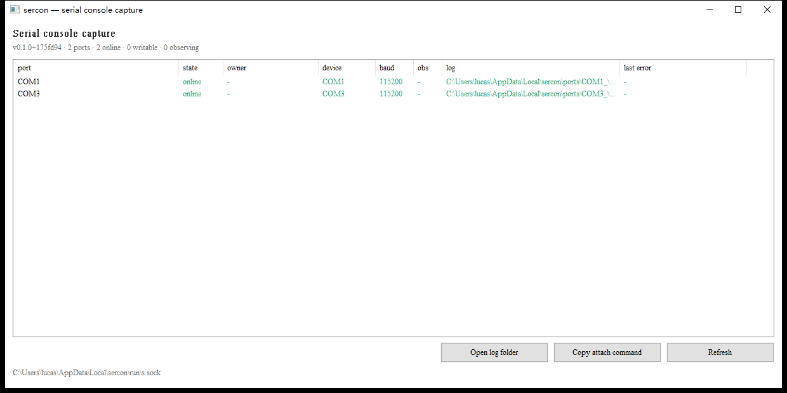

# sercon

串口的物理位置在跳板机上，你在自己机器上，中间隔着网段。sercon 让你通过 SSH
用它，像线插在自己机器上一样。



守护进程脱离 SSH 会话独立存活，没人连接的时候照样抓日志。目标机半夜重启，第二天
早上 boot log 还在。

零依赖，纯标准库。一个静态二进制丢到跳板机就能跑，不需要 root、systemd 或配置文件。

## 安装

跳板机（插着串口那台）：

```bash
scp sercond-linux-amd64 you@jump:~/bin/sercond
ssh you@jump 'chmod +x ~/bin/sercond && sudo usermod -aG dialout $USER'
```

`dialout` 那步是必须的，串口设备权限是 `crw-rw---- root:dialout`。加完重新登录
一次（组变更要新会话生效），否则端口能枚举到但全是 `offline`。

自己的机器：

```bash
install -m755 sercon-linux-amd64 ~/.local/bin/sercon
```

Windows 跳板机见 [Windows](#windows)。

## 用法

```bash
sercon ls -t you@jump                  # 看有哪些口、谁占着
sercon attach -t you@jump FT232R       # 连上去
```

`sercond` 装在 `~/bin` 而它不在远程 PATH 上时，加 `--remote-bin`：

```bash
sercon attach -t you@jump --remote-bin '~/bin/sercond' FT232R
```

`~` 要留在引号外面，否则远程 shell 不展开它。

### 命令

| 命令 | 作用 |
|---|---|
| `sercon ls -t HOST` | 列出端口：引用、设备、波特率、状态、持有者 |
| `sercon attach -t HOST PORT` | 交互式连接 |
| `sercon run -t HOST PORT` | 脚本化会话 |
| `sercon status -t HOST` | 守护进程状态 |
| `sercon stop -t HOST` | 停掉守护进程 |

四个命令都吃 `~/.ssh/config` 的别名，所以 `-t jump` 就够了，ProxyJump 交给 SSH。

`PORT` 可以只写能唯一识别的前缀，比如 `usb-FTDI_FT232R_USB_UART_A50285BI-if00-port0`
写 `FT232R` 就行。匹配到多个会报错并列出候选。

### attach

| 选项 | 作用 |
|---|---|
| `--observe` | 只读旁观，不抢写权限 |
| `--log FILE` | 本地也留一份 |
| `--no-reconnect` | 断了不重连 |
| `--baud N` | 覆盖波特率 |

默认断线自动重连。旁观者收得到输出但键盘输入不转发，所以不会两个人一起往
console 里敲字。

`Ctrl-A` 是转义键，对齐 minicom：`Ctrl-A x` 退出，`Ctrl-A a` 发送字面量 Ctrl-A，
`Ctrl-A l` 开关本地日志，`Ctrl-A r` 重连，`Ctrl-A b` 发 break，`Ctrl-A ?` 帮助。

### 管道

`attach` 不需要终端。stdin 不是 TTY 时不进 raw 模式、不认转义键、不往 stdout 写
任何装饰，行为对齐本机设备：

```bash
# 抓一段，像 cat /dev/ttyUSB1，Ctrl-C 结束
sercon attach -t jump FT232R < /dev/null | head -50

# 等一个关键字
sercon attach -t jump FT232R < /dev/null | grep -m1 panic

# 落盘
sercon attach -t jump FT232R < /dev/null >> bench01.log

# 写，像 echo -e '\r' > /dev/ttyUSB1，写完就退
sercon run -t jump FT232R --send '\r' --quiet

# 写进去再等回复
sercon run -t jump FT232R --send 'reboot\r' --expect 'Restarting system' --timeout 60s
```

两点和本地设备的差别：

- **`attach` 读到链路断为止。** `cat /dev/ttyUSB1 </dev/null` 也是这个行为——stdin
  关掉只说明没人再输入，不代表该停止读。管道模式下不自动重连，断了就结束
- **往里写用 `run --send`。** 它配 `--expect` 还能等到回复再退，比裸写更实用

stdout 只有 console 数据，端口名、日志路径这些提示走 stderr，所以重定向和管道都
不会被污染。

### run

重启目标机并抓完整 boot log：

```bash
sercon run -t jump FT232R \
  --script examples/reboot-capture.script \
  --out bench01-boot.log --timeout 90s
```

不写脚本也可以：

```bash
sercon run -t jump FT232R --send '\r' --expect 'login:' --expect '#' --timeout 30s
```

脚本语法四条：

```
send <text>      写文本，支持 \r \n \t \0 \\ \xHH
sendln <text>    写文本并追加 CRLF
wait <regex>     阻塞等正则出现
sleep 2s         暂停
```

`--expect` 没等到会报错并以非零退出：

```
sercon: --expect #1: pattern not seen before the timeout: ZZZZ_NOMATCH
```

## 日志

守护进程不看有没有人连着都写日志。

| 内容 | 位置 |
|---|---|
| 串口输出 | Linux `~/.local/state/sercon/ports/<port>/YYYY-MM-DD.log` |
| | Windows `%LOCALAPPDATA%\sercon\ports\<port>\YYYY-MM-DD.log` |
| 审计流水 | 同级的 `audit/audit-YYYY-MM-DD.jsonl` |
| 守护进程诊断 | `<runtime>/daemon.log` |
| socket | Linux `$XDG_RUNTIME_DIR/sercon/run/s.sock` |
| | Windows `%LOCALAPPDATA%\sercon\run\s.sock` |

按天换文件，只追加不删，轮转交给 logrotate。

```
2026-09-10 16:24:47.915 [177721.712505] ncsi-ioctl: NCSI_SEND_CMD_GET_RESPONSE failed
```

审计是 JSONL，一行一个事件：

```json
{"ts":"2026-09-10T16:22:21.40+08:00","event":"session_open","user":"lucas","client":"DESKTOP-ROD9JT0","session":"516954b3"}
{"ts":"2026-09-10T16:22:21.43+08:00","event":"port_open","user":"lucas","client":"DESKTOP-ROD9JT0","port":"usb-FTDI_FT232R_...-port0","dev":"/dev/ttyUSB1","session":"516954b3","detail":"writable"}
```

## 配置

`~/.config/sercon/config.json`，Windows 是 `%APPDATA%\sercon\config.json`。
全部可省略。

```json
{
  "baud": 115200,
  "ports": [
    { "ref": "usb-FTDI_FT232R_USB_UART_A50285BI-if00-port0", "desc": "WR5220-G5-bmc" },
    { "ref": "COM3", "desc": "lab-bench-01" }
  ]
}
```

| 字段 | 默认 | 说明 |
|---|---|---|
| `baud` | 115200 | 默认波特率 |
| `auto_open` | true | 启动就打开所有端口 |
| `stamp_logs` | true | 日志行首加时间戳，关掉可被终端模拟器原样回放 |
| `allow_observe` | true | 允许只读旁观 |
| `max_observers` | 4 | 每端口旁观者上限，0 不限 |
| `scan_globs` | — | Linux 上额外扫描的路径 |
| `log_dir` / `audit_dir` | — | 覆盖默认位置 |
| `ports[]` | — | 逐端口固定 `ref` / `desc` / `baud` |

`desc` 可以直接当 `attach` 的引用用。实际可用的 `ref` 看 `sercon ls -t jump --json`。

改完配置要 `sercon stop -t jump` 重启才生效。

## Windows

跳板机上两个二进制都要，分工不同：

| 文件 | 角色 | 谁启动 |
|---|---|---|
| `sercon-gui.exe` | 守护进程本体，带窗口，持有串口 | 双击，或放启动文件夹 |
| `sercond-windows-amd64.exe` | `session` / `list` / `status` / `stop` | SSH 拉起 |

只放 GUI 的话客户端连不上，SSH 需要的那几个子命令在 CLI 里。只放 CLI 的话没有
窗口，得手动 `sercond capture`。`sercon-gui.exe.manifest` 和 exe 放同一目录。

窗口里有端口表和四个按钮：打开日志目录、复制 attach 命令、SSH keys、立即重扫。
窗口开着就在抓日志，关掉就停。`sercon stop -t winjump` 会把窗口关掉。

GUI 必须在交互桌面上启动。SSH 会话里启动的进程画不出窗口，看得见进程看不见界面。
要么双击，要么放启动文件夹（`Win+R` → `shell:startup`）。

### SSH keys

`SSH keys` 按钮装客户端公钥，省得手改 `authorized_keys`。

Windows 上这件事有两个坑，都表现为同一句 `Permission denied (publickey)`：文件位置
取决于账号是不是管理员，而管理员那个文件还必须收紧 ACL。面板两件都替你做了。

管理员账号要写的是：

```
C:\ProgramData\ssh\administrators_authorized_keys
```

不是 `%USERPROFILE%\.ssh\authorized_keys`。默认的 `sshd_config` 末尾有这么一段：

```
Match Group administrators
       AuthorizedKeysFile __PROGRAMDATA__/ssh/administrators_authorized_keys
```

所以往 `~/.ssh/authorized_keys` 里写，看起来很对，但 sshd 根本不读。面板会根据账号
自动选对文件，并在顶部把路径显示出来。

那个文件的 ACL 必须只有 `SYSTEM` 和 `Administrators`，sshd 才肯读——能改这个文件
的人就能以任何身份登录。面板写完会自己收紧。

两条路径都要管理员权限，所以「Add key」和「Reload」会弹 UAC。GUI 本身不提权：
串口守护进程不该要管理员，提权只发生在写这一个文件的时候。

改动立即生效，不用重启 sshd。

挂载点这一侧还需要装 OpenSSH Server 并放行防火墙，见
[`deployment.md`](docs/deployment.md#windows-跳板机)。

Windows 上用 COM 号直接引用端口，`sercon attach -t winjump COM3`。

日志目录名会带下划线：

```
%LOCALAPPDATA%\sercon\ports\COM1_\2026-09-10.log
                              ^^^
```

`COM1` 到 `COM9` 是 Windows 保留设备名，`mkdir COM1` 直接失败，所以转义成
`COM1_`。`COM10` 及以上不是保留名，所以这个失败会随机器上用过的适配器数量
时有时无。日志内容里的头部仍写 `port=COM1`。

## 排错

**端口全是 `offline`。** Linux 上基本是 dialout 权限，`id | grep dialout` 确认，
不在组里就 `sudo usermod -aG dialout $USER` 然后重新登录。具体原因看
`sercon ls -t jump --json` 的 `last_err` 字段，表格输出里没这列。

**每条命令前面被塞了三行 SSH 警告。** 跳板机 OpenSSH 太老（Ubuntu 20.04 的 8.2、
22.04 的 8.9 都没有后量子密钥交换），stderr 被转发到终端了。加一行就好：

```
Host jump
    LogLevel ERROR
```

**`sercond: command not found`。** 不在远程 PATH 上，用 `--remote-bin` 指路径。

**`sercon stop` 之后端口还在抓。** socket 按用户隔离，确认连的是同一台机器的
同一个用户。

## 构建

```bash
make build                          # 全平台 + 版本注入 + GUI
go build -o sercond ./cmd/sercond   # 只要本机
```

版本号只有 `internal/version` 一个来源，链接时注入。裸 `go build` 显示 `devel`：

```
$ ./sercond version
sercond devel (protocol v1, go1.27.1, linux/amd64)
```

测试：

```bash
go test ./...

# 真硬件，会占用端口并拉高 DTR/RTS
SERCON_TEST_HARDWARE=1 SERCON_TEST_PORT=COM1 go test ./internal/serialport/ -v
```

硬件测试默认跳过，免得在你接了重要设备的机器上抢串口。

## 发布

打 tag 就是发布：

```bash
git tag -a v0.1.0 -m "first release"
git push origin v0.1.0
```

CI 会构建全平台、生成校验和、建 Release，并校验二进制报告的版本和 tag 一致。

## 状态

Ubuntu 20.04 / kernel 5.15 上，两个 FTDI 适配器（其中一个接 BMC 串口）实测过：
SSH 传输、脱离会话、termios + epoll 打开硬件、by-id 枚举、模糊匹配、读路径落盘、
拔线检测与自动重连、日志连续性、交互式 attach、审计流水。

没验过的两条：

- Linux 写路径只验到调用没报错。两个适配器都没接能回显的设备，也没有回环插头，
  所以「字节真的到达目标机」这一条没确认。读路径不受影响。
- Windows 拔线检测没实测。逻辑和 Linux 侧一样，但没真拔过线。

细节见 [`docs/deployment.md`](docs/deployment.md)。

## 文档

| | |
|---|---|
| [docs/usage.md](docs/usage.md) | 每个参数、脚本语法、排错 |
| [docs/design.md](docs/design.md) | 设计取舍、串口后端差异、实现陷阱 |
| [docs/deployment.md](docs/deployment.md) | 部署清单、验证记录 |
| [CHANGELOG.md](CHANGELOG.md) | 版本变更 |

## 结构

```
cmd/sercond/          跳板机端：capture / session / list / status / stop
cmd/sercon/           客户端：ls / attach / run / status / stop
cmd/sercon-gui/       Windows 带窗口的守护进程
internal/proto/       帧格式与控制消息
internal/serialport/  串口后端（linux / windows / other）
internal/hub/         端口状态机、广播、端口锁、backlog
internal/portlog/     按天轮转的串口日志
internal/audit/       JSONL 审计流水
internal/daemon/      守护进程的分离启动
internal/ipc/         socket 端点解析与单实例绑定
internal/terminal/    客户端原始终端模式
internal/sshauth/      sshd 密钥文件定位、解析与写入
internal/version/     版本号唯一来源
internal/relay/       中继传输（已实现，未接入 CLI）
internal/config/      配置
```

## License

MIT
